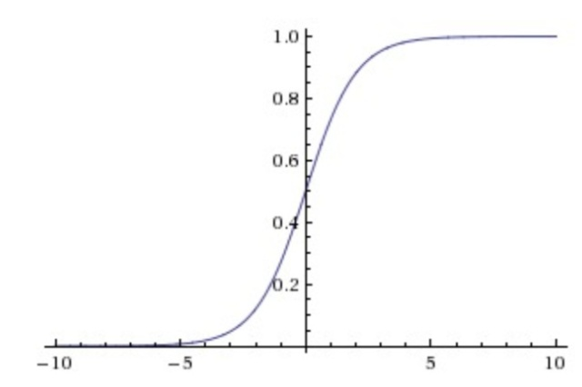

该文作为深度学习篇的开篇介绍，对深度学习作一些简单概述，后续再具体介绍CNN、RNN、LSTM、GAN每个算法。在学习深度学习前，希望有机器学习的相关知识，可以更加容易理解。

## 人工智能、机器学习、深度学习的关系

上图通俗易懂地讲明了三者之间的关系。人工智能是广义的概念，它包含机器学习和深度学习，而机器学习包含深度学习。另一种方式讲述就是机器学习包括传统机器学习(如Logistics、DecisionTree等)和深度学习(如CNN、RNN等)。

机器视觉(CV)和自然语言处理(NLP)是交叉的算法领域，深度学习、机器学习的知识都会运用到，因此，学习机器学习和深度学习的算法，了解底层原理在算法工作中是必不可少的一个环节。

## 深度学习的发展史

+ 起源阶段：
  + 1943年，心理学家麦卡洛克和数学逻辑学家皮兹发表论文《神经活动中内在思想的逻辑演算》，提出了MP模型。
  + 1949年，加拿大著名心理学家唐纳德·赫布在《行为的组织》中提出了一种基于无监督学习的规则——海布学习规则(Hebb Rule)。
  + 20世纪50年代末，在MP模型和海布学习规则的研究基础上，美国科学家罗森布拉特发现了一种类似于人类学习过程的学习算法——感知机学习。吸引了大量科学家对人工神经网络研究的兴趣，对神经网络的发展具有里程碑式的意义，但是存在**异或问题**。

+ 发展阶段：
  + 1986年，深度学习之父杰弗里·辛顿提出了一种适用于多层感知器的反向传播算法——BP算法。**BP算法完美的解决了非线性分类问题。**
+ 爆发阶段：
  + 2006年，杰弗里·辛顿以及他的学生鲁斯兰·萨拉赫丁诺夫正式提出了深度学习的概念。他们在世界顶级学术期刊《科学》发表的一篇文章中详细的给出了“梯度消失”问题的解决方案——**通过无监督的学习方法逐层训练算法，再使用有监督的反向传播算法进行调优**。
  + 2012年，在著名的ImageNet图像识别大赛中，杰弗里·辛顿领导的小组采用深度学习模型AlexNet一举夺冠。
  + 2016年，随着谷歌公司基于深度学习开发的AlphaGo以4:1的比分战胜了国际顶尖围棋高手李世石。

## 神经网络的起源

神经网络分为浅层神经网络和深层神经网络，深层神经网络就是现在的深度学习。

神经网络的灵感来自于生物神经元。其有四个特性：

1. 每个神经元都是一个多输入单输出的信息处理单元； 
2. 神经元具有空间整合和时间整合特性；  
3. 神经元输入分兴奋性输入和抑制性输入两种类型；  

4. 神经元具有阈值特性。

通过生物神经元的四个特性对应到神经网络中:

+ 多输入单输出&空间整合 ——\>多输入信号累加$$\Sigma_{i=0}^{i}x_{i}$$

+ 兴奋性/抑制性输入——>权重$w_i$的正负模拟兴奋和抑制。
+ 阈值特性——>输入超过阈值$\theta$,则被激活，信号输入到下一层神经元。

**总结：**

我们可以大体得到一个神经网络的模型，就是权重$w_i$\*输入值$x_i$的累加和形成线性函数，外面套一层激活函数，将线性转换成非线性。

函数表示为：

$$\theta(\Sigma^i_{i=1}w_ix_i+b)$$

那么接下来我们说说激活函数。

## 激活函数

### 增加激活函数的意义

如果没有激活函数，相当于是矩阵相乘，只能拟合线性函数，而在大多数情况下，线性关系的模型只能简单处理输入与输出之间的关系，而增加激活函数，非线性变换能够学习到两者间更复杂的变换关系。

### 常见的激活函数

+ **Sigmoid激活函数**

$$\color{blue}\sigma(z)=\frac{1}{1+e^-z}$$

$$\sigma(z)^\prime=\sigma(z)(1-\sigma(z))$$

优点：可将一个实数映射到(0, 1)之间，用作二分类。

缺点：在z<-5或z>5时，导数趋于0，会导致梯度消失。

+ **tanh激活函数**

$$\color{blue}\tanh(x)=2\sigma(2x)-1=\frac{e^z-e^{-z}}{e^z+e^{-z}}$$

$$\tanh(x)^\prime=1-\tanh(x)^2$$

优点：取值范围为[-1, 1]，在特征相差明显时效果会更好，在循环过程中会不断扩大特征效果。

缺点：类似sigmoid函数，容易导致梯度消失。

+ **ReLU激活函数**

$$\color{blue}relu(z)=max(0,z)$$

当$z>0$时，$relu(z)\prime=1$; 当$z\leq=0$时，$relu(z)\prime=0$

优点：函数简单，反向求导时计算量少。

缺点：当$z\leq=0$时，会出现梯度消失问题。

+ **Leaky ReLU激活函数**

$\color{blue}leakyrelu(z)=max(0.01z, z)$

优点：在ReLU的基础上，在$z\leq=0$时给予一个很小的权重，求导后结果很小，但是一个定值，不会出现梯度消失的问题，又结合了ReLU本身的优点。

## 神经网络单层公式拆解

数学公式: $\vec{y}=\sigma(W\cdot\vec{x}+b)$

$W\cdot\vec{x}$  升维/降维/放大/缩小/旋转

$+b$  平移

$\sigma$  弯曲/非线性

### 更宽 or 更深？

从上图结果中可以看到，在神经元总数相当的情况下，增加网络深度比增加网络宽度带来更强的网络表示能力，错误率也降低明显。

深度和宽度对函数复杂度的贡献是不同的，深度的贡献呈指数级增长，宽度的贡献呈线性增长。

$FC=\prod^d_{l=1}(\alpha\cdot\theta_l)^{\beta_l}$

其中$\alpha$表示每层参数(宽度)对函数复杂度的贡献，$\theta$表示参数数量，$\beta$表示深度对函数复杂度的贡献，$\alpha$和$\beta$都是一个区间，即相同参数在不同数值下仍然有不同的复杂度。$d$表示深度，$l$表示第$l$层。

## 深度神经网络(DNN)

### DNN介绍

DNN(Deep Neural Networks)是前馈神经网络，训练方法是BP算法。

DNN内部的神经网络层分为三类，输入层、隐藏层、输出层。层与层之间是全连接，从局部来看还是一个线性关系$z=\Sigma_{i=1}^i{w_ix_i}+b$加上一个激活函数$\sigma(z)$。

### DNN前向传播

前向传播算法就是通过输入层$x_i$的输入计算隐藏层的输出，再将隐藏层的结果作为输入计算输出层的结果，即利用上一层的输出计算下一层的输出。

以上图为例：$LayerL_1$是输入层，$LayerL_2$是隐藏层，$LayerL_3$是输出层。

计算$LayerL_2$的输出$a_1^{(2)}$，$a_2^{(2)}$，$a_3^{(2)}$：

$$a_1^{(2)}=\sigma(z_1^{(2)})=\sigma(\sum_{k=1}^3{w_{1k}^{(2)}x_k}+b_1^{(2)})$$

$$a_2^{(2)}=\sigma(z_2^{(2)})=\sigma(\sum_{k=1}^3{w_{2k}^{(2)}x_k}+b_2^{(2)})$$

$$a_3^{(2)}=\sigma(z_3^{(2)})=\sigma(\sum_{k=1}^3{w_{3k}^{(2)}x_k}+b_3^{(2)})$$

计算$LayerL_3$的输出$a_1^{(3)}$:

$$a_1^{(3)}=\sigma(z_1^{(3)})=\sigma(\sum_{k=1}^3{w_{1k}^{(3)}a_k^{(2)}}+b_1^{(3)})$$

将公式一般化，假设第$l-1$层有$m$个神经元，对于第$l$层的第$j$个神经元的输出为$a_j^l$，公式为：

$$a_j^l=\sigma(z_j^l)=\sigma(\sum_{k=1}^mw_{jk}^la_k^{l-1}+b_j^l)$$

其中：当$l$=2时，$a_k^1$即为输入层的$x_k$

将代数公式改为向量公式，第$l$层的输出为：

$$a^l=\sigma(z^l)=\sigma(W^la^{l-1}+b^l)$$

### DNN反向传播

BP算法(Back Propagation)是由学习过程由信号的**正向传播**与**误差的反向传播**两个过程组成。由于多层前馈网络的训练经常采用误差反向传播算法，也常将多层前馈网络直接称为BP网络。

反向传播，顾名思义就是根据已知的输出结果反向更新权重$W$。

先拆解复合函数

对复合函数链式求导

$$\frac{\partial{L}}{\partial{w_i}}=\frac{\partial{L}}{\partial{a}}\cdot\frac{\partial{a}}{\partial{z}}\cdot\frac{\partial{z}}{\partial{w_i}}$$

假设$L=\sum_{k=1}^c(a_k-y_k)^2$   $a(z)=\sigma(z)=\frac{1}{1+e^{-z}}$

则求导为：

$$\frac{\partial{L}}{\partial{w_i}}=2(a-y)\cdot{a}(1-a)\cdot{x_i}$$

Sigmoid函数的特性是当z>5时，$a(z)$趋于1，当z<-5时，$a(z)$趋于0。从求导公式中可以看到当a=0或a=1时，导数为0，这也验证了sigmoid激活函数会出现梯度消失的原因。

## 深度学习主流开发框架

+ TensorFlow2.0(1.X版本有比较多的坑，建议学习2.0版本的TensorFlow)
+ PyTorch
+ Keras

建议：可以先学习其中的一种，学会后再扩展其他框架，原理都是类似的。

## 深度学习局限性

+ 算法输出不稳定，容易被"攻击"(图像领域加噪声后容易分类错误;问答领域随机加入词，准确率明显下降)。
+ 模型复杂度高，难以纠错和调试(alphaGo)。

+ 模型层级复合程度高，参数不透明。

+ 端到端训练方式对数据依赖性强，模型增量性差(深度学习只有数据量大时，才能体验它的优势)。

+ 专注直观感知类问题，对开放性推理问题无能为力。

+ 人类知识无法有效引入进行监督，机器偏见难以避免(种族歧视问题: 算法依赖于大数据，但数据不是中立的：从真实社会中抽取，必然带有社会固有的不平等、排斥性和歧视)。

**总结：深度学习仍存在稳定性低、可调式性差、参数不透明、机器偏见、增量性差、推理能力差的问题。**

参考文献：

1. 深度学习发展史 https://zhuanlan.zhihu.com/p/34472753
2. 深度神经网络（DNN）模型与前向传播算法 https://www.cnblogs.com/pinard/p/6418668.html

